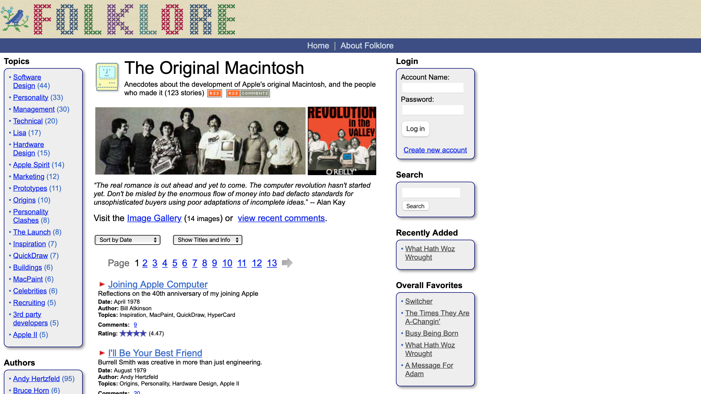
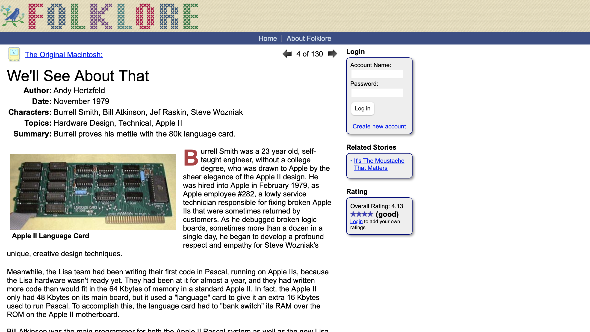
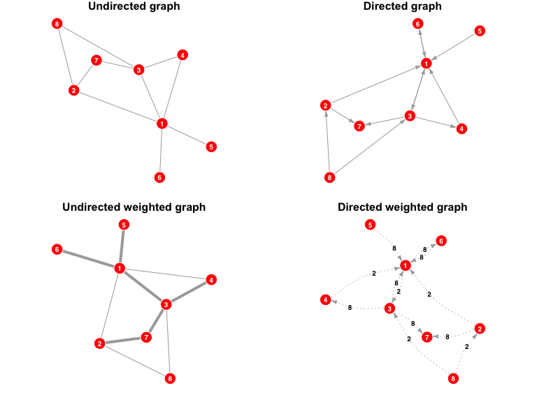
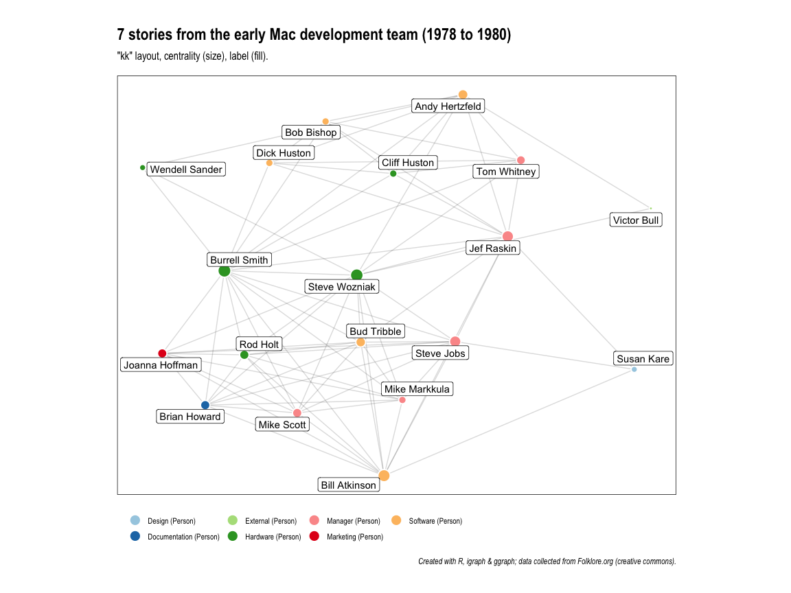
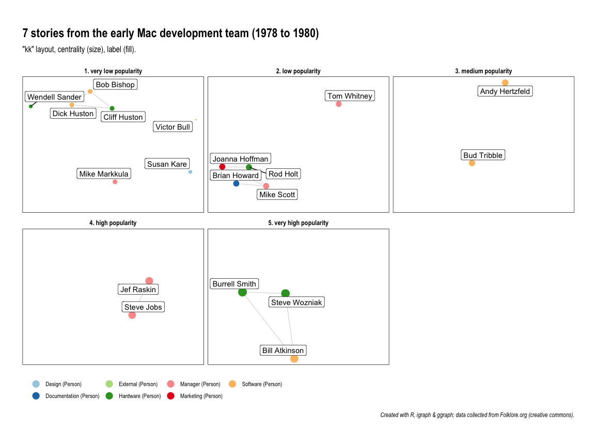
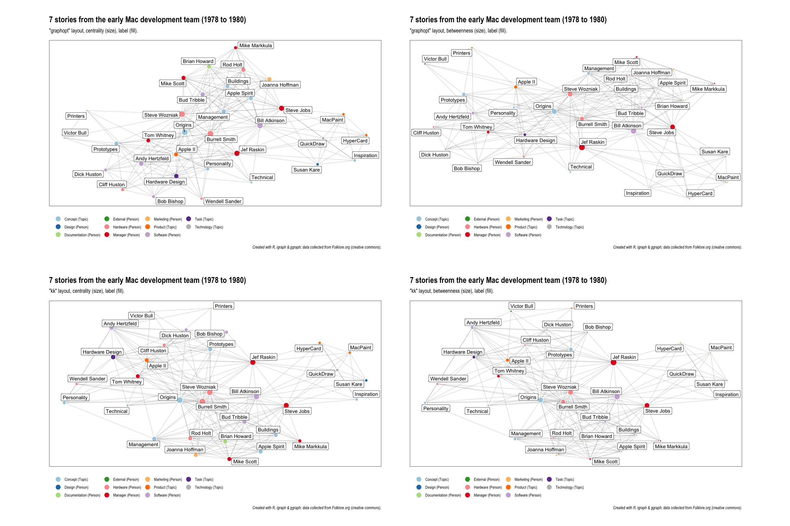

Using network graphs and R to visualize stories
================
Alex Reppel
21 January 2022

# Introduction

Now, my interest is in business history, especially the history of
Silicon Valley and the time during the 1970s and 1980s when the concept
of personal computing emerged.

I am interested in the stories that led to the development of personal
computing. I also like to explore data visually. While very often that
means exploring numerical data, today, I am going to visualise text
instead.

This is a topic that I am really passionate about … and for this video,
I am using a network chart to visualise links between people that appear
in the same stories together.



Data for this project is taken from the
[Folklore.org](https://www.folklore.org/) website where members of the
original Macintosh development team share anecdotes about their time
working at Apple, which was then called Apple Computer, Inc. because
they were building, well, computers.

The content on the website is published under a creative commons
license, which means we are able to use it for this project.

The question, then, is how to get from the
[Folklore.org](https://www.folklore.org/) website into a network graph?

First, we need to extract the people and topics that appear in anecdotes
together. Here, you see one such anecdote, which very helpfully already
includes a list of characters and topics.



This is what we are after. While we could extract that data
programmatically, for this demonstration, I have manually copied
characters and topics for the first seven stories into a spreadsheet.

For this, I have created two files (available in the `assets/data/`
directory). The first file is the most important one and contains links
between entities. This is the file from which we will create our
network. The second file is optional and allows us to add attributes to
each entity. We see two attributes, both of which I have coded manually:
A broad `category` to distinguish people and topics, and a more detailed
`description`.

This is all we need to get started.

# Libraries

We begin by loading the necessary libraries.

``` r
# Graph objects
library(igraph)
# Data manipulation
library(tidyverse)
# Data visualisation
library(ggraph)
library(tidygraph)
# Arranging graphs
library(patchwork)
```

# Networks

Before I begin converting that data into a network graph, I would like
to say a few words about these kind of graphs.

There are many things to consider when working with network graphs, two
of which I believe are essential.

First, we have to distinguish between so-called `undirected` and
`directed` graphs. Second, we have to distinguish between graphs that
are `weighted` and those that are `non-weighted`.

I have generated four examples to illustrate this. You can see them here
and the all use the same data set.

<!-- -->

On the left you see two undirected graphs and on the right you see two
directed graphs. The top row shows non-weighted graphs, and the bottom
row shows weighted graphs.

While not particularly precise in mathematical terms, I like to think of
undirected graphs as indicating a mutual link or relationship, such as
between, say, a married couple. This is different in directed graphs,
where the link or relationship may not be mutual. One person may be in
love with another person, but that does not necessarily mean that their
feelings are reciprocated.

Now, a weighted graph means that the link or relationship between two
entities is qualified in some shape or form. In a non-weighted graph, we
may show that two people have met at least once. That’s it. In a
weighted graph, we can distinguish the number of times they have met,
or, in our case, the number of times they appear together in a story.

I should also clarify the terminology I use. So far, I have spoken of
`entities`, but the technical term that is commonly used is `nodes` or
`vertices`. Similarly, I have spoken of `links` or `relationships` and
the more appropriate term is perhaps `edges`.

Now, this will be sufficient for the time being and we can now begin
creating a network graph.

# Load data

The first step is to load the data from our two external files.

``` r
EDGES <- read.csv("assets/data/Macintosh-edges.csv")
NODES <- read.csv("assets/data/Macintosh-nodes.csv")
```

We can quickly confirm that everything went well by looking at the first
few lines of the two data frames we’ve just created.

    ##            from         to
    ## 1 Bill Atkinson Jef Raskin
    ## 2 Bill Atkinson Steve Jobs
    ## 3 Bill Atkinson Susan Kare
    ## 4    Jef Raskin Steve Jobs
    ## 5    Jef Raskin Susan Kare
    ## 6    Steve Jobs Susan Kare

    ##             name description category
    ## 1 Andy Hertzfeld    Software   Person
    ## 2  Bill Atkinson    Software   Person
    ## 3  Burrell Smith    Hardware   Person
    ## 4     Jef Raskin     Manager   Person
    ## 5     Steve Jobs     Manager   Person
    ## 6  Steve Wozniak    Hardware   Person

Sure enough, everything looks good. We have successfully loaded all the
data we need to create a `graph object`.

But before we do that, I am quickly creating another column in the
`NODES` data frame where I combine the `description` and `category` for
each node. We will call this column `label`.

``` r
NODES$label <- sprintf(
  "%s (%s)", NODES$description, NODES$category)
```

# Graph object

It is now time to initialise our graph object. All we have to do is to
create it from our `EDGES` data frame. Because our network visualises
people and topics that appear together in the same stories, our graph
will be undirected.

## Initialising

``` r
GRAPH <- graph_from_data_frame(
  EDGES,
  directed = FALSE)
```

Let’s quickly explore the graph object by displaying it in the form of a
table.

    ## # A tbl_graph: 33 nodes and 235 edges
    ## #
    ## # An undirected multigraph with 1 component
    ## #
    ## # Node Data: 33 × 1 (active)
    ##   name         
    ##   <chr>        
    ## 1 Bill Atkinson
    ## 2 Jef Raskin   
    ## 3 Steve Jobs   
    ## 4 Inspiration  
    ## 5 MacPaint     
    ## 6 QuickDraw    
    ## # … with 27 more rows
    ## #
    ## # Edge Data: 235 × 2
    ##    from    to
    ##   <int> <int>
    ## 1     1     2
    ## 2     1     3
    ## 3     1    29
    ## # … with 232 more rows

We see that our graph object contains a total of 235 edges between 33
unique nodes.

## As adjacency matrix

A different, and perhaps more readable, way of showing a network is in
the form of an adjacency matrix. The following table shows a subset of
our graph object.

    ## 4 x 4 sparse Matrix of class "dgCMatrix"
    ##                Bill Atkinson Jef Raskin Joanna Hoffman Susan Kare
    ## Bill Atkinson              .          2              1          1
    ## Jef Raskin                 2          .              .          1
    ## Joanna Hoffman             1          .              .          .
    ## Susan Kare                 1          1              .          .

Here, we see for example that the `Bill Atkinson` and `Jef Raskin`
appear together in two stories, while everyone else appears together
only once.

## Weighted graph

If we want to create a weighted graph, a quick way to do that is by
loading the adjacency matrix of our existing `GRAPH` object into the new
`WEIGHTED_GRAPH` object.

``` r
WEIGHTED_GRAPH <- graph.adjacency(
  as_adjacency_matrix(GRAPH),
  mode = "undirected",
  weighted = TRUE)
```

Once again displaying a graph object as a table shows us what has
changed. Here, we can see an additional column to store the `weight`
between nodes.

    ## # A tbl_graph: 33 nodes and 204 edges
    ## #
    ## # An undirected simple graph with 1 component
    ## #
    ## # Node Data: 33 × 1 (active)
    ##   name         
    ##   <chr>        
    ## 1 Bill Atkinson
    ## 2 Jef Raskin   
    ## 3 Steve Jobs   
    ## 4 Inspiration  
    ## 5 MacPaint     
    ## 6 QuickDraw    
    ## # … with 27 more rows
    ## #
    ## # Edge Data: 204 × 3
    ##    from    to weight
    ##   <int> <int>  <dbl>
    ## 1     1     2      2
    ## 2     1     3      2
    ## 3     1     4      1
    ## # … with 201 more rows

## Adding attributes

It is now time to add attributes for each node from the `NODES` data
frame. An easy way of merging data from the `NODES` data frame into our
`WEIGHTED_GRAPH` object is to use the `left_join()` function and to
match nodes by `name`
([Source](https://stackoverflow.com/questions/45338398/how-do-you-add-vertice-node-information-when-starting-from-adjacency-matrix)).

``` r
WEIGHTED_GRAPH <- WEIGHTED_GRAPH %>%
  as_tbl_graph() %>%
  left_join(NODES, by = c("name" = "name"))
```

Once again, we can confirm that everything worked well by showing the
graph object as a table.

    ## # A tbl_graph: 33 nodes and 204 edges
    ## #
    ## # An undirected simple graph with 1 component
    ## #
    ## # Node Data: 33 × 4 (active)
    ##   name          description category label             
    ##   <chr>         <chr>       <chr>    <chr>             
    ## 1 Bill Atkinson Software    Person   Software (Person) 
    ## 2 Jef Raskin    Manager     Person   Manager (Person)  
    ## 3 Steve Jobs    Manager     Person   Manager (Person)  
    ## 4 Inspiration   Concept     Topic    Concept (Topic)   
    ## 5 MacPaint      Product     Topic    Product (Topic)   
    ## 6 QuickDraw     Technology  Topic    Technology (Topic)
    ## # … with 27 more rows
    ## #
    ## # Edge Data: 204 × 3
    ##    from    to weight
    ##   <int> <int>  <dbl>
    ## 1     1     2      2
    ## 2     1     3      2
    ## 3     1     4      1
    ## # … with 201 more rows

Sure enough, all attributes from the `NODES` data frame were
successfully added.

# Shortest path

An interesting application of network analysis is to calculate the
shortest path between nodes. In this example, we list all the shortest
paths between two persons: `Victor Bull` and `Susan Kare`.

Sure enough, we are presented with several paths between the two, each
with a length of four.

``` r
all_shortest_paths(
  WEIGHTED_GRAPH, from = "Victor Bull", to = "Susan Kare")
```

    ## $res
    ## $res[[1]]
    ## + 4/33 vertices, named, from 30e682c:
    ## [1] Victor Bull   Apple II      Bill Atkinson Susan Kare   
    ## 
    ## $res[[2]]
    ## + 4/33 vertices, named, from 30e682c:
    ## [1] Victor Bull   Steve Wozniak Jef Raskin    Susan Kare   
    ## 
    ## $res[[3]]
    ## + 4/33 vertices, named, from 30e682c:
    ## [1] Victor Bull    Andy Hertzfeld Jef Raskin     Susan Kare    
    ## 
    ## $res[[4]]
    ## + 4/33 vertices, named, from 30e682c:
    ## [1] Victor Bull Prototypes  Jef Raskin  Susan Kare 
    ## 
    ## $res[[5]]
    ## + 4/33 vertices, named, from 30e682c:
    ## [1] Victor Bull Apple II    Jef Raskin  Susan Kare 
    ## 
    ## $res[[6]]
    ## + 4/33 vertices, named, from 30e682c:
    ## [1] Victor Bull   Steve Wozniak Steve Jobs    Susan Kare   
    ## 
    ## 
    ## $nrgeo
    ##  [1]  1  4  1  6  6  6  6  1  1  3  2  2  1  1  1  1  1  2  3  2  2 17  1  1  1
    ## [26]  1  1  1  6  1  2  1  1

# Centrality

Another interesting application of network analysis is the calculation
of how prominent a node is within the network. This is done by
calculating one of a number of `centrality` measures. For this
illustration, I have picked two:

1.  First, **[degree
    centrality](https://www.sciencedirect.com/topics/computer-science/degree-centrality):**
    For undirected graphs, degree centrality is the sum of incoming and
    outgoing edges
2.  Second, **[betweeness
    centrality](https://www.sciencedirect.com/topics/computer-science/betweenness-centrality):**
    Betweeness centrality is a measure to highlight a node’s position
    between other nodes in the network. One application taken from the
    literature is “a person’s role in allowing information to pass from
    one part of the network to the other”
    [ref](https://www.sciencedirect.com/book/9780128016565/introduction-to-social-media-investigation)

## Degree centrality

OK, let’s begin with degree centrality, which is quickly calculated
using the `centrality_degree()` function.

``` r
WEIGHTED_GRAPH <- WEIGHTED_GRAPH %>%
  as_tbl_graph() %>% 
  activate(nodes) %>%  # tidygraph
  mutate(centrality  = centrality_degree())  # tidyverse
```

## Betweeness centrality

Similarly, we can calculate betweeness centrality using the
`betweenness()` function.

``` r
WEIGHTED_GRAPH <- WEIGHTED_GRAPH %>%
  as_tbl_graph() %>% 
  activate(nodes) %>%  # tidygraph
  mutate(betweenness  = betweenness(WEIGHTED_GRAPH))  # tidyverse
```

In a small network such as ours, these calculations are done almost
instantaneous. For larger networks with thousands, millions, or even
billions of nodes, however, these calculations can be computationally
expensive.

Before we move on, I would like to create one more measure, one that I
find useful to create small multiples of a network graph later on. It is
to split `degree_centrality` into five categories as a measure of
`popularity`
([ref](https://ggraph.data-imaginist.com/reference/facet_graph.html)).

``` r
WEIGHTED_GRAPH <- WEIGHTED_GRAPH %>%
  as_tbl_graph() %>%
  mutate(popularity = as.character(cut(centrality_degree(mode = "in"),
    breaks = 5,
    labels = c(
      "1. very low popularity",
      "2. low popularity",
      "3. medium popularity",
      "4. high popularity",
      "5. very high popularity")
  )))
```

Before we start plotting our graph object, let’s have a quick look at it
again. Once again shown here as a table, we can see that the centrality
measures were added as new columns.

    ## # A tbl_graph: 33 nodes and 204 edges
    ## #
    ## # An undirected simple graph with 1 component
    ## #
    ## # Node Data: 33 × 7 (active)
    ##   name          description category label              central… betwee… popula…
    ##   <chr>         <chr>       <chr>    <chr>                 <dbl>   <dbl> <chr>  
    ## 1 Bill Atkinson Software    Person   Software (Person)        22  56.9   5. ver…
    ## 2 Jef Raskin    Manager     Person   Manager (Person)         20  65.6   4. hig…
    ## 3 Steve Jobs    Manager     Person   Manager (Person)         19  38.7   4. hig…
    ## 4 Inspiration   Concept     Topic    Concept (Topic)           7   0.217 1. ver…
    ## 5 MacPaint      Product     Topic    Product (Topic)           7   0.217 1. ver…
    ## 6 QuickDraw     Technology  Topic    Technology (Topic)        7   0.217 1. ver…
    ## # … with 27 more rows
    ## #
    ## # Edge Data: 204 × 3
    ##    from    to weight
    ##   <int> <int>  <dbl>
    ## 1     1     2      2
    ## 2     1     3      2
    ## 3     1     4      1
    ## # … with 201 more rows

This is good and allows us to use them when plotting our network graph.

# Plotting

Plotting a graph in [R](https://www.r-project.org) is both quick and
easy to customise with the `ggplot2` package, or, in our case, the
`ggraph` package that combines the power of the excellent network
analysis tool `igraph` with the power of the `ggplot2` visualisation
package.

## Colour palette

First, we specify a colour palette. We could import one of the
pre-defined palettes from
[ColorBrewer](https://colorbrewer2.org/#type=qualitative&scheme=Paired&n=11),
but for this example, I have copied the values for a qualitative palette
for up to 11 categories.

Although not necessary, I prefer to overwrite the last item in the list
with the colour `gray`.

``` r
colour_palette <- c(
  "#a6cee3",
  "#1f78b4",
  "#b2df8a",
  "#33a02c",
  "#fb9a99",
  "#e31a1c",
  "#fdbf6f",
  "#ff7f00",
  "#cab2d6",
  "#6a3d9a",
  "#ffff99")
colour_palette <- replace(colour_palette, length(colour_palette), "gray")
```

## Initialise graph

OK, the first step is to initialise the graph. This looks much more
complicated than it actually is. We wouldn’t ahve to do much if we were
happy with the default presentation.

However, I have a tendency to tinker with different options until I find
a style that I like. I also prefer to put this into a function, which I
can call with different variations of my data set.

This example here allows me to specify different data sets and layouts
to arrange my graph. So far, I haven’t spoken about layouts, but you
will see later on how they influence the arrangement of nodes.

With this function, I am also able to specify how data should be
represented by two different visual variables: The `SIZE` of each node
and their `FILL` colour.

``` r
plot_graph <- function(DATA, LAYOUT, SIZE, FILL, RATIO=0.75) {
  plot <- ggraph(DATA, layout = LAYOUT) +
    geom_edge_link(color = "black", alpha = 0.15) +
    geom_node_point(
      aes_string(size = SIZE, fill = FILL),
      colour = "white", shape = 21,
      stroke = 1, show.legend = TRUE) +
    geom_node_label(
      aes(label = name), repel = TRUE) +
    guides(
    size = "none",
    fill = guide_legend(override.aes = list(size = 5))) +
    scale_fill_manual(values = colour_palette) +
    theme_graph() +
    theme(
      aspect.ratio = RATIO,
      panel.background = element_rect(fill = "white"),
      plot.title = element_text(size = 18, face = "bold"),
      panel.grid.major = element_blank(),
      panel.grid.minor = element_blank(),
      legend.position = "bottom",
      legend.justification = "left",
      legend.title = element_blank()
      ) +
    labs(
      title = paste0(
        length(unique(EDGES_ALL$story)),
        " stories from the early Mac development team (",
        min(EDGES_ALL$year), " to ", max(EDGES_ALL$year), ")"),
      subtitle = paste0(
        '"', LAYOUT, '" layout, ', SIZE, ' (size), ', FILL, ' (fill).'),
      caption = paste0(
        "Created with R, igraph & ggraph; ",
        "data collected from Folklore.org (creative commons)."))
  return(plot)
  }
```

Swiftly moving on, let’s generate our first plot!

## A single plot

To keep things simple, I have selected only nodes representing a
`Person` and also specified the
[Kamada-Kawai](https://igraph.org/c/doc/igraph-Layout.html#igraph_layout_kamada_kawai)
layout – or `kk` layout – which is one of [many
layouts](https://igraph.org/c/doc/igraph-Layout.html) supported by the
[igraph](https://igraph.org/) network analysis tool.

``` r
plot_graph(
  induced_subgraph(  # data
    WEIGHTED_GRAPH,
    which(V(WEIGHTED_GRAPH)$category=="Person")),
  "kk",              # layout
  "centrality",      # size
  "label"            # fill
  )
```

    ## Warning: `aes_string()` was deprecated in ggplot2 3.0.0.
    ## ℹ Please use tidy evaluation ideoms with `aes()`

    ## Warning: Using the `size` aesthetic in this geom was deprecated in ggplot2 3.4.0.
    ## ℹ Please use `linewidth` in the `default_aes` field and elsewhere instead.

<!-- -->

In this example, the `SIZE` attribute represents `degree_centrality` for
each node and the `FILL` attribute represents a node’s `label`, that is
a combination of the attributes `description` and `category`.

We can already being exploring the graph. For example, we can speculate
about some of the dynamics within the network, such as the fact that two
of the five *Hardware Engineers* seem to play a central role in the
stories that we extracted from the
[Folklore.org](https://www.folklore.org/) website.

Interesting is also the role of the five *Managers* in the network, two
of which–*Steve Jobs* and *Mike Markkula*–were co-founders of Apple
Computer and one–*Mike Scott*–was the firm’s President at the time. But
it is a different manager, *Jef Raskin*, who seems to play a much more
central role in these stories, even though he was neither a co-founder
nor was he part of the firm’s senior management team at the time.

For those familiar with the early history of Apple Computer, *Jef
Raskin*’s exposed position does, of course, not come as a surprise.
While our graph relates to the early history of Apple Computer, it
visualises anecdotes from the early days of the Macintosh project. It
was *Jef Raskin* who started the project and who led it for the first
couple of years before he was sidelined by one of the co-founders,
*Steve Jobs*, and eventually left the company.

## Multiple plots

We can explore the graph further by creating a series of small multiples
using the `popularity` measure that we calculated earlier.

``` r
plot_graph(
  induced_subgraph(  # data
    WEIGHTED_GRAPH,
    which(V(WEIGHTED_GRAPH)$category=="Person")),
  "kk",              # layout
  "centrality",      # size
  "label"            # fill
  )  +
  facet_nodes(~ popularity)
```

<!-- -->

What we have done is essentially representing `degree_centrality` in two
different ways: First, with the `SIZE` of each node, and then again, in
aggregated form, to create small multiples. This is not good practice,
but nicely illustrates the use of small multiples.

Looking at these graphs, we see for exmaple that our earlier suspicion
have been confirmed: The nodes with the highest `popularity` or
`degree_centrality` are the two *Hardware Engineers* Steve Wozniak, the
inventor of the first two Apple computers and another co-founder, and
Burrell Smith, the main designer of the first Macintosh hardware. They
are accompanied in that category by Bill Atkinson who played a pivotal
role in creating Macintosh. Amongst other things, he designed the
graphics routines that made it possible to display overlapping windows.
Now common place, this was an incredible achievement at the time on a
computer as underpowered as the first Macintosh.

## Different combinations

This is probably enough for one tutorial. But before we end, I would
like to show you a combination of different layout and centrality
measures.

<!-- -->

I won’t be able to go into too much detail here, but these examples
demonstrate a few things. First, network graphs can get very complex
very quickly. Remember, we are currently only showing a total of 235
edges between 33 unique nodes. Second, it is very easy to combine
different kinds of entities, such as persons and topics. Together, they
allow us to get essentially a “bird’s eye view” on the collective
anecdotes used for this project. Third, part of the process of exploring
network graphs is to identify a suitable centrality measure and network
layout. For example, `betweenness` seems to be a good measure if we want
to identify nodes that keep the network together, or, in our case, those
that draw individual anecdotes together into the story of the early
Macintosh development.

# Conclusion

To me, experimenting with different layouts and centrality measures is
what makes visual network analysis interesting. I am new to this and
still learning, but in the future, I hope to be able to develop this
project further, perhaps creating an interactive graph to allow visitors
to access anecdotes on the [Folklore.org](https://www.folklore.org/)
website by selecting a combination of people and topics in the graph.
